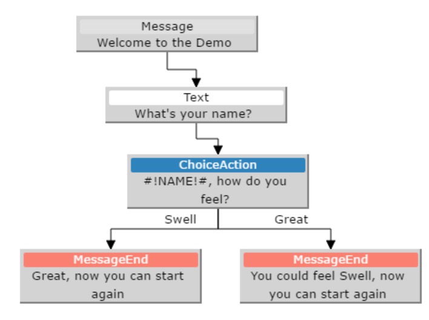

# LAM.BotFramework

#### A Data Driven Framework for Microsoft Bot Framework

The Bot flow is defined by a data structure.
The flow definition is stored in Azure Table Storage. This enables version control and change of the flow without editing code.

The data is stored in JSON and has this format:
```javascript
public class QuestionRow
    {
        [JsonProperty("q")]
        public string QuestionText { get; set; } //The text to be displayed
        [JsonProperty("type")]
        public string QuestionType { get; set; } //Text, Message, MessageEnd, LUIS, QnAMaker, Integer
        [JsonProperty("max")]
        public string Max { get; set; } //Max for Integer/Numbers
        [JsonProperty("options")]
        public string Options { get; set; } //JSON format or....
        [JsonProperty("nextq")]
        public string NextQ { get; set; } //{intent:'Yes', nextq:'6'},{intent:'No', nextq:'7'}
        [JsonProperty("node")]
        public string NodeName { get; set; } //Node Name = Variable Name
        [JsonProperty("sub")]
        public string Sub { get; set; }  //subroutine that the node belogs to
        [JsonProperty("langdet")]
        public string LangDet { get; set; } //allow language detection on this node
        [JsonProperty("bypass")]
        public string BypassNode { get; set; } //bypass this node if variable with NodeName already exists
    }
```

To use the Framework you will need to:
1. Initialize the Framework:
 
   In **Global.asax.cs**, in **Application_Start()** add this lines:
```javascript
    Task T = LAM.BotFramework.Global.Initialization();
    T.Wait();
```
2. Define variables in Web.Config
   
   For table naming, Azure Table Name rules apply:
```javascript
    <add key="LAMBF.StorageConnectionString" value="<YourAzureConnectionString>" />
    <add key="LAMBF.ScenarioTableName" value="<YourScenarioTableName>" />
    <add key="LAMBF.ScenarioName" value="<YourScenarioName>" />
    <add key="LAMBF.LogTableName" value="<YourLogTableName>" />
```
3. Call the Framework dialog
4. In the *Post* method in the *MessagesController*, call the dialog:
```javascript
    await Conversation.SendAsync(activity, () => new MainDialog());
```
As alternative, you can call the Framework from inside your dialog with:
```javascript
   Question Q = new Question(context);
   await Q.Initialize(JSon);
```

Please check the LAM.BotFramework.Admin project for utilities and blank template.

### Sample

This is the example of the json data format that is stored in the Azure Storage
```json
[
{"x":154,"y":38,"width":200,"height":40,
 "q":"Welcome to the Demo","type":"Message","node":"NODE0","sub":"main","options":"","langdet":"Yes","bypass":"No","nextq":"[{\"intent\":\"\",\"q\":1}]"},
{"x":186,"y":116,"width":200,"height":40,
 "q":"What's your name?","type":"Text","node":"NAME","sub":"main","options":"","langdet":"Yes","bypass":"No","nextq":"[{\"intent\":\"\",\"q\":2}]"},
{"x":210,"y":190,"width":200,"height":60,
 "q":"#!NAME!#, how do you feel?","type":"ChoiceAction","node":"NODE2","sub":"main","options":"","langdet":"Yes","bypass":"No","nextq":"[{\"intent\":\"Swell\",\"q\":3},{\"intent\":\"Great\",\"q\":4}]"},
{"x":92,"y":294,"width":200,"height":60,
 "q":"Great, now you can start again","type":"MessageEnd","node":"NODE3","sub":"main","options":"","langdet":"Yes","bypass":"No","nextq":"-1"},{"x":334,"y":294,"width":200,"height":60,"q":"You could feel Swell, now you can start again","type":"MessageEnd","node":"NODE4","sub":"main","options":"","langdet":"Yes","bypass":"No","nextq":"-1"}
]
```
it is the equivalent to this flow chart in the flow editor:

Note that all the end steps need to be of type "MessageEnd"

### Code

Together with the framework code you'll find a DemoBot project. Just correct the tags in web.config and goto to

http://localhost:3982/FlowEditorAdmin/default.htm

and create a new flow.

### Final Note

This code is in evolution. It will probably not do everything you need, take it as the base to build your own flow driven bots.

And please provide feedback...